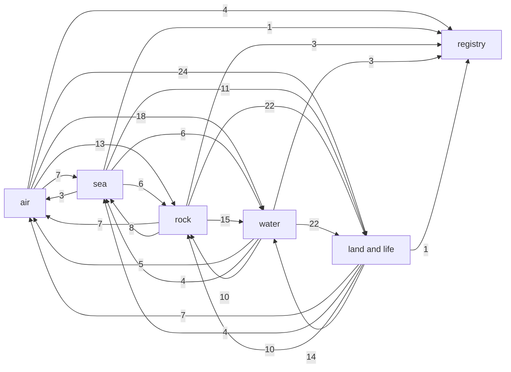

# The coupling graph

Generated from `couplings.go` by `TERRA_COUPLINGS=write go test -run TestCouplingsDoc -timeout 60m .`; do not edit it by hand.

Which pass of world creation reads which of the world's fields and writes which, and the feedback loops that makes. The declaration is held to the code by `couplings_test.go`: each pass's source is read for the fields it touches, and worlds are made stage by stage and every field a stage changes has to be one of that stage's passes' writes. A loop a later change adds - the climate of each epoch (#57), the carbon thermostat (#58), albedo from the surface (#59), land and air trading water (#60), the ice ages (#61), mountains and climate (#62), sea and air together (#28), fog over cold water (#29) - is one line in `couplings`, and a field it brings one line in `worldFields`.

## The fields

| System | Field | What it is |
|---|---|---|
| air | energy | the energy balance row by row: the year's mean warmth, what the air can take up, how wet it is |
| air | wind | the wind, the pressure, the air's budget of water and the sea's currents, as package atmos works them out |
| air | rain | each tile's year of rain, what runs off, its summer's share and its day's range, and each air cell's share of the year's evaporation by phase |
| air | year | each tile's year at sea level: its mean and its swing |
| sea | sea | the level of the sea and of the water the air takes its fill from |
| sea | tide | the tide's reach and the flats it lays bare |
| rock | height | the ground's height, and on a globe the height of the country it lies in at the planet's scale |
| rock | floor | the deep sea floor: where it stood before its age laid it down, how fast the rock rose, how old the crust is |
| rock | rock | the rock: each tile's bed, the epoch it was laid in, and the beds under it |
| rock | plates | which plate each tile rides, which plate each has been welded into, and the hotspots |
| rock | book | the book the history kept of what it did to each tile, and how many epochs it ran |
| water | drainage | where each tile's water goes and how much runs through it, and how far it stands over it |
| water | load | the ground the water carries: off the land, and off the banks of its bends |
| water | moisture | the soil's water through the year: each phase's rain into it, what it holds and what it sheds, and the most it holds |
| water | snow | the snow through the year: the water lying in it each phase, the share of the ground it covers, what melts, and the mass balance of the snow that outlasts the year |
| water | lakes | the standing water: the lakes, their level, and the salt pans |
| land and life | soil | the soil: how deep, what it is made of, and what time has made of it |
| land and life | cover | what each tile is: open ground, forest, water, ice, outcrop, tidal flat, salt |
| land and life | woods | where trees will take, and the map's measure of its ground they are read against |
| land and life | plants | what grows on each tile, type by type: the share of its ground each covers, the carbon it holds and its leaf area |
| land and life | fertility | what the soil will grow |
| land and life | stocks | what stands to be taken: the fish, the grass, and how long what stands has grown |
| registry | features | the registry of the things the tiles make up, and their relations |

## The systems

System to system: an arrow is a pass that reads a field of the one and writes a field of the other, numbered with how many such pairs of fields there are.

## The graph

Field to field: each field, and the fields the passes that read it write.

| Field | Drives |
|---|---|
| energy | wind (weather); rain (weather, cover); sea (history, cutThroughCycle); tide (tides); height (history, settleHistory, shape, landslide, cutThroughCycle, wear); floor (settleHistory); rock (history, keepBook, settleHistory, shape); plates (history); book (history, keepBook, wear); drainage (flow); load (history, wear, waterStep); moisture (weather, cover); snow (weather, cover); lakes (pool, flow); soil (history, landslide, cutThroughCycle, wear, soilTexture, laySoil); cover (tides, cover); woods (tides, cover, readWoods); plants (cover); fertility (tides, cover); stocks (tides, cover); features (readFeatures) |
| wind | rain (weather, cover); year (year); sea (cutThroughCycle); tide (tides); height (shape, landslide, cutThroughCycle, wear); rock (shape); book (wear); drainage (flow); load (wear, waterStep); moisture (weather, cover); snow (weather, cover); lakes (pool, flow); soil (landslide, cutThroughCycle, wear, soilTexture, laySoil); cover (tides, cover); woods (tides, cover, readWoods); plants (cover); fertility (tides, cover); stocks (tides, cover); features (readFeatures) |
| rain | wind (weather); sea (cutThroughCycle); tide (tides); height (shape, landslide, cutThroughCycle, wear); rock (shape); book (wear); drainage (flow); load (wear, waterStep); moisture (weather, cover); snow (weather, cover); lakes (pool, flow); soil (landslide, cutThroughCycle, wear, soilTexture, laySoil); cover (tides, cover); woods (tides, cover, readWoods); plants (cover); fertility (tides, cover); stocks (tides, cover); features (readFeatures) |
| year | wind (weather); rain (weather, cover); tide (tides); height (wear); book (wear); load (wear, waterStep); moisture (weather, cover); snow (weather, cover); soil (wear, laySoil); cover (freeze, tides, cover); woods (tides, cover, readWoods); plants (cover); fertility (tides, cover); stocks (freeze, tides, cover); features (readFeatures) |
| sea | wind (weather); rain (weather, cover); year (year); tide (tides); height (history, tectonics, layCountry, shape, texture, denude, landslide, cutThroughCycle, wear, silt); rock (history, tectonics, keepBook, shape); plates (history, tectonics); book (history, tectonics, keepBook, wear); drainage (flow); load (history, wear, waterStep); moisture (weather, cover); snow (weather, cover); lakes (pool, flow); soil (history, landslide, cutThroughCycle, wear, silt, soilTexture, laySoil); cover (pour, level, carve, freeze, tides, cover); woods (pour, level, carve, tides, cover, readWoods); plants (cover); fertility (tides, cover); stocks (pour, level, carve, freeze, tides, cover); features (readFeatures) |
| tide | height (wear, silt); book (wear); load (wear, waterStep); soil (wear, silt); cover (tides); woods (tides); fertility (tides); stocks (tides) |
| height | wind (weather); rain (weather, cover); year (year); sea (history, pour, level, cutThroughCycle); tide (tides); floor (settleHistory); rock (history, move, tectonics, keepBook, settleRock, handDown, settleHistory, layBedrock, expose, shape); plates (history, move, tectonics, settleRock, handDown); book (history, tectonics, keepBook, handDown, wear); drainage (flow, height); load (history, wear, waterStep); moisture (weather, cover); snow (weather, cover); lakes (pool, flow); soil (history, move, handDown, landslide, cutThroughCycle, wear, silt, soilTexture, laySoil); cover (move, handDown, pour, level, carve, freeze, tides, cover); woods (pour, level, carve, tides, cover, readWoods); plants (cover); fertility (tides, cover); stocks (pour, level, carve, freeze, tides, cover); features (readFeatures) |
| floor | wind (weather); rain (weather, cover); sea (pour, cutThroughCycle); tide (tides); height (settleHistory, shape, texture, landslide, cutThroughCycle, wear); rock (settleHistory, shape); book (wear); drainage (flow, height); load (wear); moisture (weather, cover); snow (weather, cover); lakes (pool, flow); soil (landslide, cutThroughCycle, wear, laySoil); cover (pour, freeze, tides, cover); woods (pour, tides, cover, readWoods); plants (cover); fertility (tides, cover); stocks (pour, freeze, tides, cover) |
| rock | wind (weather); rain (weather, cover); sea (history, cutThroughCycle); tide (tides); height (history, move, tectonics, handDown, settleHistory, shape, denude, landslide, cutThroughCycle, wear); floor (settleHistory); plates (history, move, tectonics, settleRock, handDown); book (history, tectonics, keepBook, handDown, wear); load (history, wear, waterStep); moisture (weather, cover); snow (weather, cover); soil (history, move, handDown, landslide, cutThroughCycle, wear, soilTexture, laySoil); cover (move, handDown, tides, cover); woods (tides, cover); plants (cover); fertility (tides, cover); stocks (tides, cover) |
| plates | sea (history); height (history, move, tectonics, handDown); rock (history, move, tectonics, settleRock, handDown); book (history, tectonics, handDown); load (history); soil (history, move, handDown); cover (move, handDown); features (readFeatures) |
| book | sea (history); height (history, tectonics, handDown, settleHistory, wear); floor (settleHistory); rock (history, tectonics, keepBook, handDown, settleHistory); plates (history, tectonics, handDown); load (history, wear); soil (history, handDown, wear); cover (handDown); features (readFeatures) |
| drainage | rain (cover); sea (history); tide (tides); height (history, wear); rock (history, keepBook); plates (history); book (history, keepBook, wear); load (history, wear, waterStep); moisture (cover); snow (cover); lakes (flow); soil (history, wear, laySoil); cover (carve, tides, cover); woods (carve, tides, cover, readWoods); plants (cover); fertility (tides, cover); stocks (carve, tides, cover); features (readFeatures) |
| load | sea (history); height (history, wear); rock (history); plates (history); book (history, wear); soil (history, wear) |
| moisture | wind (weather); rain (weather, cover); snow (weather, cover); cover (cover); woods (cover); plants (cover); fertility (cover); stocks (cover) |
| snow | wind (weather); rain (weather, cover); moisture (weather, cover); cover (cover); woods (cover, readWoods); plants (cover); fertility (cover); stocks (cover); features (readFeatures) |
| lakes | tide (tides); height (denude, wear); book (wear); drainage (flow, height); load (wear, waterStep); soil (wear); cover (carve, freeze, tides); woods (carve, tides); fertility (tides); stocks (carve, freeze, tides); features (readFeatures) |
| soil | wind (weather); rain (weather, cover); sea (history, cutThroughCycle); tide (tides); height (history, move, handDown, landslide, cutThroughCycle, wear, silt); rock (history, move, keepBook, handDown); plates (history, move, handDown); book (history, keepBook, handDown, wear); load (history, wear, waterStep); moisture (weather, cover); snow (weather, cover); cover (move, handDown, tides, cover); woods (tides, cover); plants (cover); fertility (tides, cover); stocks (tides, cover) |
| cover | rain (cover); sea (history, pour, level, cutThroughCycle); tide (tides); height (history, shape, denude, landslide, cutThroughCycle, wear); rock (history, keepBook, shape); plates (history); book (history, keepBook, wear); drainage (height); load (history, wear, waterStep); moisture (cover); snow (cover); soil (history, landslide, cutThroughCycle, wear, soilTexture, laySoil); woods (pour, level, carve, tides, cover, readWoods); plants (cover); fertility (tides, cover); stocks (pour, level, carve, freeze, tides, cover); features (readFeatures) |
| woods | rain (cover); moisture (cover); snow (cover); cover (cover); plants (cover); fertility (cover); stocks (cover) |
| plants | wind (weather); rain (weather, cover); height (wear); book (wear); load (wear); moisture (weather, cover); snow (weather, cover); soil (wear, laySoil); cover (cover); woods (cover, readWoods); fertility (cover); stocks (cover) |
| fertility | rain (cover); moisture (cover); snow (cover); cover (cover); woods (cover); plants (cover); stocks (cover) |
| stocks |  |
| features |  |

## The passes

| Pass | Stages | Reads | Writes |
|---|---|---|---|
| newGround | ground |  | energy |
| historyGround | ground |  | energy |
| history | ground | energy, sea, height, rock, plates, book, drainage, load, soil, cover | sea, height, rock, plates, book, load, soil |
| flood | ground |  |  |
| move | ground | height, rock, plates, soil | height, rock, plates, soil, cover |
| joinUp | ground | plates | plates |
| tectonics | ground | sea, height, rock, plates, book | height, rock, plates, book |
| reshape | ground | plates | plates |
| keepBook | ground | energy, sea, height, rock, book, drainage, soil, cover | rock, book |
| settleRock | ground | height, plates, rock | plates, rock |
| handDown | ground | height, rock, plates, book, soil | height, rock, plates, book, soil, cover |
| settleHistory | ground | energy, height, floor, rock, book | height, floor, rock |
| basins | ground | height | height |
| raise | ground |  | height |
| layBedrock | ground | height, rock | rock |
| expose | ground, shape, cut, coast | height, rock | rock |
| pour | sea, cut, coast | sea, height, floor, cover | sea, cover, woods, stocks |
| level | sea, cut, coast | sea, height, cover | sea, cover, woods, stocks |
| layCountry | sea | height, sea | height |
| shape | shape | energy, wind, rain, sea, height, floor, rock, cover | height, rock |
| texture | shape | floor, height, sea | height |
| denude | shape | cover, height, lakes, rock, sea | height |
| landslide | ground, shape, cut | cover, energy, floor, height, rain, rock, sea, soil, wind | height, soil |
| drain | ground, shape, cut, coast | floor, height, rain, sea, wind |  |
| weather | ground, shape, cut, coast | energy, wind, rain, year, sea, height, floor, rock, moisture, snow, soil, plants | wind, rain, moisture, snow |
| defaultAir | ground, shape, cut, coast | energy | energy |
| pool | ground, shape, cut, coast, cover | energy, wind, rain, sea, height, floor, lakes | lakes |
| flow | ground, shape, cut, coast, cover | energy, wind, rain, sea, height, floor, drainage, lakes | drainage, lakes |
| gradeCountry | shape, cut, coast | sea, height, drainage |  |
| cutValleys | cut |  |  |
| cutThroughCycle | cut | cover, energy, floor, height, rain, rock, sea, soil, wind | height, sea, soil |
| carve | cut | sea, height, drainage, lakes, cover | cover, woods, stocks |
| height | cut, coast | cover, drainage, floor, height, lakes | drainage |
| wear | ground, cut | energy, wind, rain, year, sea, tide, height, floor, rock, book, drainage, load, lakes, soil, cover, plants | height, book, load, soil |
| creep | ground, cut | cover, drainage, floor, height, soil |  |
| waterStep | ground, cut, coast | energy, wind, rain, year, sea, tide, height, rock, drainage, load, lakes, soil, cover | load |
| year | coast | wind, sea, height | year |
| freeze | coast | cover, floor, height, lakes, sea, year | cover, stocks |
| tides | coast | energy, wind, rain, year, sea, tide, height, floor, rock, drainage, lakes, soil, cover | tide, cover, woods, fertility, stocks |
| silt | coast | sea, tide, height, soil | height, soil |
| cover | cover | energy, wind, rain, year, sea, height, floor, rock, drainage, moisture, snow, soil, cover, woods, plants, fertility | rain, moisture, snow, cover, woods, plants, fertility, stocks |
| readWoods | cover | energy, wind, rain, year, sea, height, floor, drainage, snow, cover, woods, plants | woods |
| soilTexture | ground, cover | cover, energy, height, rain, rock, sea, wind | soil |
| laySoil | cover | energy, wind, rain, year, sea, height, floor, rock, drainage, soil, cover, plants | soil |
| recount | cover | sea, height, floor |  |
| readFeatures | cover | energy, wind, rain, year, sea, height, plates, book, drainage, snow, lakes, cover | features |
| readRelations | cover | energy, wind, rain, sea, height, plates, lakes |  |

## The loops

Fields that drive one another round some loop, each set by Tarjan's strongly connected components:

- wind, rain, year, sea, tide, height, floor, rock, plates, book, drainage, load, moisture, snow, lakes, soil, cover, woods, plants, fertility

Every loop of up to 3 fields, found by walking the graph: each field drives the next and the last the first, through the passes named, with the systems it goes through. A loop one pass makes alone, reading and writing its own fields, is not counted. 549 loops: 66 of two fields and 483 of three.

- wind -(weather, cover)-> rain -(weather)-> wind [air]
- wind -(year)-> year -(weather)-> wind [air]
- wind -(cutThroughCycle)-> sea -(weather)-> wind [air, sea]
- wind -(shape, landslide, cutThroughCycle, wear)-> height -(weather)-> wind [air, rock]
- wind -(shape)-> rock -(weather)-> wind [air, rock]
- wind -(weather, cover)-> moisture -(weather)-> wind [air, water]
- wind -(weather, cover)-> snow -(weather)-> wind [air, water]
- wind -(landslide, cutThroughCycle, wear, soilTexture, laySoil)-> soil -(weather)-> wind [air, land and life]
- wind -(cover)-> plants -(weather)-> wind [air, land and life]
- rain -(cutThroughCycle)-> sea -(weather, cover)-> rain [air, sea]
- rain -(shape, landslide, cutThroughCycle, wear)-> height -(weather, cover)-> rain [air, rock]
- rain -(shape)-> rock -(weather, cover)-> rain [air, rock]
- rain -(flow)-> drainage -(cover)-> rain [air, water]
- rain -(weather, cover)-> moisture -(weather, cover)-> rain [air, water]
- rain -(weather, cover)-> snow -(weather, cover)-> rain [air, water]
- rain -(landslide, cutThroughCycle, wear, soilTexture, laySoil)-> soil -(weather, cover)-> rain [air, land and life]
- rain -(tides, cover)-> cover -(cover)-> rain [air, land and life]
- rain -(tides, cover, readWoods)-> woods -(cover)-> rain [air, land and life]
- rain -(cover)-> plants -(weather, cover)-> rain [air, land and life]
- rain -(tides, cover)-> fertility -(cover)-> rain [air, land and life]
- year -(wear)-> height -(year)-> year [air, rock]
- sea -(history, tectonics, layCountry, shape, texture, denude, landslide, cutThroughCycle, wear, silt)-> height -(history, pour, level, cutThroughCycle)-> sea [sea, rock]
- sea -(history, tectonics, keepBook, shape)-> rock -(history, cutThroughCycle)-> sea [sea, rock]
- sea -(history, tectonics)-> plates -(history)-> sea [sea, rock]
- sea -(history, tectonics, keepBook, wear)-> book -(history)-> sea [sea, rock]
- sea -(flow)-> drainage -(history)-> sea [sea, water]
- sea -(history, wear, waterStep)-> load -(history)-> sea [sea, water]
- sea -(history, landslide, cutThroughCycle, wear, silt, soilTexture, laySoil)-> soil -(history, cutThroughCycle)-> sea [sea, land and life]
- sea -(pour, level, carve, freeze, tides, cover)-> cover -(history, pour, level, cutThroughCycle)-> sea [sea, land and life]
- tide -(wear, silt)-> height -(tides)-> tide [sea, rock]
- tide -(wear, silt)-> soil -(tides)-> tide [sea, land and life]
- height -(settleHistory)-> floor -(settleHistory, shape, texture, landslide, cutThroughCycle, wear)-> height [rock]
- height -(history, move, tectonics, keepBook, settleRock, handDown, settleHistory, layBedrock, expose, shape)-> rock -(history, move, tectonics, handDown, settleHistory, shape, denude, landslide, cutThroughCycle, wear)-> height [rock]
- height -(history, move, tectonics, settleRock, handDown)-> plates -(history, move, tectonics, handDown)-> height [rock]
- height -(history, tectonics, keepBook, handDown, wear)-> book -(history, tectonics, handDown, settleHistory, wear)-> height [rock]
- height -(flow, height)-> drainage -(history, wear)-> height [rock, water]
- height -(history, wear, waterStep)-> load -(history, wear)-> height [rock, water]
- height -(pool, flow)-> lakes -(denude, wear)-> height [rock, water]
- height -(history, move, handDown, landslide, cutThroughCycle, wear, silt, soilTexture, laySoil)-> soil -(history, move, handDown, landslide, cutThroughCycle, wear, silt)-> height [rock, land and life]
- height -(move, handDown, pour, level, carve, freeze, tides, cover)-> cover -(history, shape, denude, landslide, cutThroughCycle, wear)-> height [rock, land and life]
- height -(cover)-> plants -(wear)-> height [rock, land and life]
- floor -(settleHistory, shape)-> rock -(settleHistory)-> floor [rock]
- floor -(wear)-> book -(settleHistory)-> floor [rock]
- rock -(history, move, tectonics, settleRock, handDown)-> plates -(history, move, tectonics, settleRock, handDown)-> rock [rock]
- rock -(history, tectonics, keepBook, handDown, wear)-> book -(history, tectonics, keepBook, handDown, settleHistory)-> rock [rock]
- rock -(history, wear, waterStep)-> load -(history)-> rock [rock, water]
- rock -(history, move, handDown, landslide, cutThroughCycle, wear, soilTexture, laySoil)-> soil -(history, move, keepBook, handDown)-> rock [rock, land and life]
- rock -(move, handDown, tides, cover)-> cover -(history, keepBook, shape)-> rock [rock, land and life]
- plates -(history, tectonics, handDown)-> book -(history, tectonics, handDown)-> plates [rock]
- plates -(history, move, handDown)-> soil -(history, move, handDown)-> plates [rock, land and life]
- plates -(move, handDown)-> cover -(history)-> plates [rock, land and life]
- book -(history, wear)-> load -(history, wear)-> book [rock, water]
- book -(history, handDown, wear)-> soil -(history, keepBook, handDown, wear)-> book [rock, land and life]
- book -(handDown)-> cover -(history, keepBook, wear)-> book [rock, land and life]
- drainage -(flow)-> lakes -(flow, height)-> drainage [water]
- drainage -(carve, tides, cover)-> cover -(height)-> drainage [water, land and life]
- load -(history, wear)-> soil -(history, wear, waterStep)-> load [water, land and life]
- moisture -(weather, cover)-> snow -(weather, cover)-> moisture [water]
- moisture -(cover)-> plants -(weather, cover)-> moisture [water, land and life]
- snow -(cover, readWoods)-> woods -(cover)-> snow [water, land and life]
- snow -(cover)-> plants -(weather, cover)-> snow [water, land and life]
- soil -(move, handDown, tides, cover)-> cover -(history, landslide, cutThroughCycle, wear, soilTexture, laySoil)-> soil [land and life]
- soil -(cover)-> plants -(wear, laySoil)-> soil [land and life]
- cover -(pour, level, carve, tides, cover, readWoods)-> woods -(cover)-> cover [land and life]
- cover -(tides, cover)-> fertility -(cover)-> cover [land and life]
- woods -(cover)-> plants -(cover, readWoods)-> woods [land and life]

The 483 loops of three fields

- wind -(weather, cover)-> rain -(cutThroughCycle)-> sea -(weather)-> wind [air, sea]
- wind -(weather, cover)-> rain -(shape, landslide, cutThroughCycle, wear)-> height -(weather)-> wind [air, rock]
- wind -(weather, cover)-> rain -(shape)-> rock -(weather)-> wind [air, rock]
- wind -(weather, cover)-> rain -(weather, cover)-> moisture -(weather)-> wind [air, water]
- wind -(weather, cover)-> rain -(weather, cover)-> snow -(weather)-> wind [air, water]
- wind -(weather, cover)-> rain -(landslide, cutThroughCycle, wear, soilTexture, laySoil)-> soil -(weather)-> wind [air, land and life]
- wind -(weather, cover)-> rain -(cover)-> plants -(weather)-> wind [air, land and life]
- wind -(year)-> year -(weather, cover)-> rain -(weather)-> wind [air]
- wind -(year)-> year -(wear)-> height -(weather)-> wind [air, rock]
- wind -(year)-> year -(weather, cover)-> moisture -(weather)-> wind [air, water]
- wind -(year)-> year -(weather, cover)-> snow -(weather)-> wind [air, water]
- wind -(year)-> year -(wear, laySoil)-> soil -(weather)-> wind [air, land and life]
- wind -(year)-> year -(cover)-> plants -(weather)-> wind [air, land and life]
- wind -(cutThroughCycle)-> sea -(weather, cover)-> rain -(weather)-> wind [air, sea]
- wind -(cutThroughCycle)-> sea -(year)-> year -(weather)-> wind [air, sea]
- wind -(cutThroughCycle)-> sea -(history, tectonics, layCountry, shape, texture, denude, landslide, cutThroughCycle, wear, silt)-> height -(weather)-> wind [air, sea, rock]
- wind -(cutThroughCycle)-> sea -(history, tectonics, keepBook, shape)-> rock -(weather)-> wind [air, sea, rock]
- wind -(cutThroughCycle)-> sea -(weather, cover)-> moisture -(weather)-> wind [air, sea, water]
- wind -(cutThroughCycle)-> sea -(weather, cover)-> snow -(weather)-> wind [air, sea, water]
- wind -(cutThroughCycle)-> sea -(history, landslide, cutThroughCycle, wear, silt, soilTexture, laySoil)-> soil -(weather)-> wind [air, sea, land and life]
- wind -(cutThroughCycle)-> sea -(cover)-> plants -(weather)-> wind [air, sea, land and life]
- wind -(tides)-> tide -(wear, silt)-> height -(weather)-> wind [air, sea, rock]
- wind -(tides)-> tide -(wear, silt)-> soil -(weather)-> wind [air, sea, land and life]
- wind -(shape, landslide, cutThroughCycle, wear)-> height -(weather, cover)-> rain -(weather)-> wind [air, rock]
- wind -(shape, landslide, cutThroughCycle, wear)-> height -(year)-> year -(weather)-> wind [air, rock]
- wind -(shape, landslide, cutThroughCycle, wear)-> height -(history, pour, level, cutThroughCycle)-> sea -(weather)-> wind [air, sea, rock]
- wind -(shape, landslide, cutThroughCycle, wear)-> height -(settleHistory)-> floor -(weather)-> wind [air, rock]
- wind -(shape, landslide, cutThroughCycle, wear)-> height -(history, move, tectonics, keepBook, settleRock, handDown, settleHistory, layBedrock, expose, shape)-> rock -(weather)-> wind [air, rock]
- wind -(shape, landslide, cutThroughCycle, wear)-> height -(weather, cover)-> moisture -(weather)-> wind [air, rock, water]
- wind -(shape, landslide, cutThroughCycle, wear)-> height -(weather, cover)-> snow -(weather)-> wind [air, rock, water]
- wind -(shape, landslide, cutThroughCycle, wear)-> height -(history, move, handDown, landslide, cutThroughCycle, wear, silt, soilTexture, laySoil)-> soil -(weather)-> wind [air, rock, land and life]
- wind -(shape, landslide, cutThroughCycle, wear)-> height -(cover)-> plants -(weather)-> wind [air, rock, land and life]
- wind -(shape)-> rock -(weather, cover)-> rain -(weather)-> wind [air, rock]
- wind -(shape)-> rock -(history, cutThroughCycle)-> sea -(weather)-> wind [air, sea, rock]
- wind -(shape)-> rock -(history, move, tectonics, handDown, settleHistory, shape, denude, landslide, cutThroughCycle, wear)-> height -(weather)-> wind [air, rock]
- wind -(shape)-> rock -(settleHistory)-> floor -(weather)-> wind [air, rock]
- wind -(shape)-> rock -(weather, cover)-> moisture -(weather)-> wind [air, rock, water]
- wind -(shape)-> rock -(weather, cover)-> snow -(weather)-> wind [air, rock, water]
- wind -(shape)-> rock -(history, move, handDown, landslide, cutThroughCycle, wear, soilTexture, laySoil)-> soil -(weather)-> wind [air, rock, land and life]
- wind -(shape)-> rock -(cover)-> plants -(weather)-> wind [air, rock, land and life]
- wind -(wear)-> book -(history)-> sea -(weather)-> wind [air, sea, rock]
- wind -(wear)-> book -(history, tectonics, handDown, settleHistory, wear)-> height -(weather)-> wind [air, rock]
- wind -(wear)-> book -(settleHistory)-> floor -(weather)-> wind [air, rock]
- wind -(wear)-> book -(history, tectonics, keepBook, handDown, settleHistory)-> rock -(weather)-> wind [air, rock]
- wind -(wear)-> book -(history, handDown, wear)-> soil -(weather)-> wind [air, rock, land and life]
- wind -(flow)-> drainage -(cover)-> rain -(weather)-> wind [air, water]
- wind -(flow)-> drainage -(history)-> sea -(weather)-> wind [air, sea, water]
- wind -(flow)-> drainage -(history, wear)-> height -(weather)-> wind [air, rock, water]
- wind -(flow)-> drainage -(history, keepBook)-> rock -(weather)-> wind [air, rock, water]
- wind -(flow)-> drainage -(cover)-> moisture -(weather)-> wind [air, water]
- wind -(flow)-> drainage -(cover)-> snow -(weather)-> wind [air, water]
- wind -(flow)-> drainage -(history, wear, laySoil)-> soil -(weather)-> wind [air, water, land and life]
- wind -(flow)-> drainage -(cover)-> plants -(weather)-> wind [air, water, land and life]
- wind -(wear, waterStep)-> load -(history)-> sea -(weather)-> wind [air, sea, water]
- wind -(wear, waterStep)-> load -(history, wear)-> height -(weather)-> wind [air, rock, water]
- wind -(wear, waterStep)-> load -(history)-> rock -(weather)-> wind [air, rock, water]
- wind -(wear, waterStep)-> load -(history, wear)-> soil -(weather)-> wind [air, water, land and life]
- wind -(weather, cover)-> moisture -(weather, cover)-> rain -(weather)-> wind [air, water]
- wind -(weather, cover)-> moisture -(weather, cover)-> snow -(weather)-> wind [air, water]
- wind -(weather, cover)-> moisture -(cover)-> plants -(weather)-> wind [air, water, land and life]
- wind -(weather, cover)-> snow -(weather, cover)-> rain -(weather)-> wind [air, water]
- wind -(weather, cover)-> snow -(weather, cover)-> moisture -(weather)-> wind [air, water]
- wind -(weather, cover)-> snow -(cover)-> plants -(weather)-> wind [air, water, land and life]
- wind -(pool, flow)-> lakes -(denude, wear)-> height -(weather)-> wind [air, rock, water]
- wind -(pool, flow)-> lakes -(wear)-> soil -(weather)-> wind [air, water, land and life]
- wind -(landslide, cutThroughCycle, wear, soilTexture, laySoil)-> soil -(weather, cover)-> rain -(weather)-> wind [air, land and life]
- wind -(landslide, cutThroughCycle, wear, soilTexture, laySoil)-> soil -(history, cutThroughCycle)-> sea -(weather)-> wind [air, sea, land and life]
- wind -(landslide, cutThroughCycle, wear, soilTexture, laySoil)-> soil -(history, move, handDown, landslide, cutThroughCycle, wear, silt)-> height -(weather)-> wind [air, rock, land and life]
- wind -(landslide, cutThroughCycle, wear, soilTexture, laySoil)-> soil -(history, move, keepBook, handDown)-> rock -(weather)-> wind [air, rock, land and life]
- wind -(landslide, cutThroughCycle, wear, soilTexture, laySoil)-> soil -(weather, cover)-> moisture -(weather)-> wind [air, water, land and life]
- wind -(landslide, cutThroughCycle, wear, soilTexture, laySoil)-> soil -(weather, cover)-> snow -(weather)-> wind [air, water, land and life]
- wind -(landslide, cutThroughCycle, wear, soilTexture, laySoil)-> soil -(cover)-> plants -(weather)-> wind [air, land and life]
- wind -(tides, cover)-> cover -(cover)-> rain -(weather)-> wind [air, land and life]
- wind -(tides, cover)-> cover -(history, pour, level, cutThroughCycle)-> sea -(weather)-> wind [air, sea, land and life]
- wind -(tides, cover)-> cover -(history, shape, denude, landslide, cutThroughCycle, wear)-> height -(weather)-> wind [air, rock, land and life]
- wind -(tides, cover)-> cover -(history, keepBook, shape)-> rock -(weather)-> wind [air, rock, land and life]
- wind -(tides, cover)-> cover -(cover)-> moisture -(weather)-> wind [air, water, land and life]
- wind -(tides, cover)-> cover -(cover)-> snow -(weather)-> wind [air, water, land and life]
- wind -(tides, cover)-> cover -(history, landslide, cutThroughCycle, wear, soilTexture, laySoil)-> soil -(weather)-> wind [air, land and life]
- wind -(tides, cover)-> cover -(cover)-> plants -(weather)-> wind [air, land and life]
- wind -(tides, cover, readWoods)-> woods -(cover)-> rain -(weather)-> wind [air, land and life]
- wind -(tides, cover, readWoods)-> woods -(cover)-> moisture -(weather)-> wind [air, water, land and life]
- wind -(tides, cover, readWoods)-> woods -(cover)-> snow -(weather)-> wind [air, water, land and life]
- wind -(tides, cover, readWoods)-> woods -(cover)-> plants -(weather)-> wind [air, land and life]
- wind -(cover)-> plants -(weather, cover)-> rain -(weather)-> wind [air, land and life]
- wind -(cover)-> plants -(wear)-> height -(weather)-> wind [air, rock, land and life]
- wind -(cover)-> plants -(weather, cover)-> moisture -(weather)-> wind [air, water, land and life]
- wind -(cover)-> plants -(weather, cover)-> snow -(weather)-> wind [air, water, land and life]
- wind -(cover)-> plants -(wear, laySoil)-> soil -(weather)-> wind [air, land and life]
- wind -(tides, cover)-> fertility -(cover)-> rain -(weather)-> wind [air, land and life]
- wind -(tides, cover)-> fertility -(cover)-> moisture -(weather)-> wind [air, water, land and life]
- wind -(tides, cover)-> fertility -(cover)-> snow -(weather)-> wind [air, water, land and life]
- wind -(tides, cover)-> fertility -(cover)-> plants -(weather)-> wind [air, land and life]
- rain -(cutThroughCycle)-> sea -(year)-> year -(weather, cover)-> rain [air, sea]
- rain -(cutThroughCycle)-> sea -(history, tectonics, layCountry, shape, texture, denude, landslide, cutThroughCycle, wear, silt)-> height -(weather, cover)-> rain [air, sea, rock]
- rain -(cutThroughCycle)-> sea -(history, tectonics, keepBook, shape)-> rock -(weather, cover)-> rain [air, sea, rock]
- rain -(cutThroughCycle)-> sea -(flow)-> drainage -(cover)-> rain [air, sea, water]
- rain -(cutThroughCycle)-> sea -(weather, cover)-> moisture -(weather, cover)-> rain [air, sea, water]
- rain -(cutThroughCycle)-> sea -(weather, cover)-> snow -(weather, cover)-> rain [air, sea, water]
- rain -(cutThroughCycle)-> sea -(history, landslide, cutThroughCycle, wear, silt, soilTexture, laySoil)-> soil -(weather, cover)-> rain [air, sea, land and life]
- rain -(cutThroughCycle)-> sea -(pour, level, carve, freeze, tides, cover)-> cover -(cover)-> rain [air, sea, land and life]
- rain -(cutThroughCycle)-> sea -(pour, level, carve, tides, cover, readWoods)-> woods -(cover)-> rain [air, sea, land and life]
- rain -(cutThroughCycle)-> sea -(cover)-> plants -(weather, cover)-> rain [air, sea, land and life]
- rain -(cutThroughCycle)-> sea -(tides, cover)-> fertility -(cover)-> rain [air, sea, land and life]
- rain -(tides)-> tide -(wear, silt)-> height -(weather, cover)-> rain [air, sea, rock]
- rain -(tides)-> tide -(wear, silt)-> soil -(weather, cover)-> rain [air, sea, land and life]
- rain -(tides)-> tide -(tides)-> cover -(cover)-> rain [air, sea, land and life]
- rain -(tides)-> tide -(tides)-> woods -(cover)-> rain [air, sea, land and life]
- rain -(tides)-> tide -(tides)-> fertility -(cover)-> rain [air, sea, land and life]
- rain -(shape, landslide, cutThroughCycle, wear)-> height -(year)-> year -(weather, cover)-> rain [air, rock]
- rain -(shape, landslide, cutThroughCycle, wear)-> height -(history, pour, level, cutThroughCycle)-> sea -(weather, cover)-> rain [air, sea, rock]
- rain -(shape, landslide, cutThroughCycle, wear)-> height -(settleHistory)-> floor -(weather, cover)-> rain [air, rock]
- rain -(shape, landslide, cutThroughCycle, wear)-> height -(history, move, tectonics, keepBook, settleRock, handDown, settleHistory, layBedrock, expose, shape)-> rock -(weather, cover)-> rain [air, rock]
- rain -(shape, landslide, cutThroughCycle, wear)-> height -(flow, height)-> drainage -(cover)-> rain [air, rock, water]
- rain -(shape, landslide, cutThroughCycle, wear)-> height -(weather, cover)-> moisture -(weather, cover)-> rain [air, rock, water]
- rain -(shape, landslide, cutThroughCycle, wear)-> height -(weather, cover)-> snow -(weather, cover)-> rain [air, rock, water]
- rain -(shape, landslide, cutThroughCycle, wear)-> height -(history, move, handDown, landslide, cutThroughCycle, wear, silt, soilTexture, laySoil)-> soil -(weather, cover)-> rain [air, rock, land and life]
- rain -(shape, landslide, cutThroughCycle, wear)-> height -(move, handDown, pour, level, carve, freeze, tides, cover)-> cover -(cover)-> rain [air, rock, land and life]
- rain -(shape, landslide, cutThroughCycle, wear)-> height -(pour, level, carve, tides, cover, readWoods)-> woods -(cover)-> rain [air, rock, land and life]
- rain -(shape, landslide, cutThroughCycle, wear)-> height -(cover)-> plants -(weather, cover)-> rain [air, rock, land and life]
- rain -(shape, landslide, cutThroughCycle, wear)-> height -(tides, cover)-> fertility -(cover)-> rain [air, rock, land and life]
- rain -(shape)-> rock -(history, cutThroughCycle)-> sea -(weather, cover)-> rain [air, sea, rock]
- rain -(shape)-> rock -(history, move, tectonics, handDown, settleHistory, shape, denude, landslide, cutThroughCycle, wear)-> height -(weather, cover)-> rain [air, rock]
- rain -(shape)-> rock -(settleHistory)-> floor -(weather, cover)-> rain [air, rock]
- rain -(shape)-> rock -(weather, cover)-> moisture -(weather, cover)-> rain [air, rock, water]
- rain -(shape)-> rock -(weather, cover)-> snow -(weather, cover)-> rain [air, rock, water]
- rain -(shape)-> rock -(history, move, handDown, landslide, cutThroughCycle, wear, soilTexture, laySoil)-> soil -(weather, cover)-> rain [air, rock, land and life]
- rain -(shape)-> rock -(move, handDown, tides, cover)-> cover -(cover)-> rain [air, rock, land and life]
- rain -(shape)-> rock -(tides, cover)-> woods -(cover)-> rain [air, rock, land and life]
- rain -(shape)-> rock -(cover)-> plants -(weather, cover)-> rain [air, rock, land and life]
- rain -(shape)-> rock -(tides, cover)-> fertility -(cover)-> rain [air, rock, land and life]
- rain -(wear)-> book -(history)-> sea -(weather, cover)-> rain [air, sea, rock]
- rain -(wear)-> book -(history, tectonics, handDown, settleHistory, wear)-> height -(weather, cover)-> rain [air, rock]
- rain -(wear)-> book -(settleHistory)-> floor -(weather, cover)-> rain [air, rock]
- rain -(wear)-> book -(history, tectonics, keepBook, handDown, settleHistory)-> rock -(weather, cover)-> rain [air, rock]
- rain -(wear)-> book -(history, handDown, wear)-> soil -(weather, cover)-> rain [air, rock, land and life]
- rain -(wear)-> book -(handDown)-> cover -(cover)-> rain [air, rock, land and life]
- rain -(flow)-> drainage -(history)-> sea -(weather, cover)-> rain [air, sea, water]
- rain -(flow)-> drainage -(history, wear)-> height -(weather, cover)-> rain [air, rock, water]
- rain -(flow)-> drainage -(history, keepBook)-> rock -(weather, cover)-> rain [air, rock, water]
- rain -(flow)-> drainage -(cover)-> moisture -(weather, cover)-> rain [air, water]
- rain -(flow)-> drainage -(cover)-> snow -(weather, cover)-> rain [air, water]
- rain -(flow)-> drainage -(history, wear, laySoil)-> soil -(weather, cover)-> rain [air, water, land and life]
- rain -(flow)-> drainage -(carve, tides, cover)-> cover -(cover)-> rain [air, water, land and life]
- rain -(flow)-> drainage -(carve, tides, cover, readWoods)-> woods -(cover)-> rain [air, water, land and life]
- rain -(flow)-> drainage -(cover)-> plants -(weather, cover)-> rain [air, water, land and life]
- rain -(flow)-> drainage -(tides, cover)-> fertility -(cover)-> rain [air, water, land and life]
- rain -(wear, waterStep)-> load -(history)-> sea -(weather, cover)-> rain [air, sea, water]
- rain -(wear, waterStep)-> load -(history, wear)-> height -(weather, cover)-> rain [air, rock, water]
- rain -(wear, waterStep)-> load -(history)-> rock -(weather, cover)-> rain [air, rock, water]
- rain -(wear, waterStep)-> load -(history, wear)-> soil -(weather, cover)-> rain [air, water, land and life]
- rain -(weather, cover)-> moisture -(weather, cover)-> snow -(weather, cover)-> rain [air, water]
- rain -(weather, cover)-> moisture -(cover)-> cover -(cover)-> rain [air, water, land and life]
- rain -(weather, cover)-> moisture -(cover)-> woods -(cover)-> rain [air, water, land and life]
- rain -(weather, cover)-> moisture -(cover)-> plants -(weather, cover)-> rain [air, water, land and life]
- rain -(weather, cover)-> moisture -(cover)-> fertility -(cover)-> rain [air, water, land and life]
- rain -(weather, cover)-> snow -(weather, cover)-> moisture -(weather, cover)-> rain [air, water]
- rain -(weather, cover)-> snow -(cover)-> cover -(cover)-> rain [air, water, land and life]
- rain -(weather, cover)-> snow -(cover, readWoods)-> woods -(cover)-> rain [air, water, land and life]
- rain -(weather, cover)-> snow -(cover)-> plants -(weather, cover)-> rain [air, water, land and life]
- rain -(weather, cover)-> snow -(cover)-> fertility -(cover)-> rain [air, water, land and life]
- rain -(pool, flow)-> lakes -(denude, wear)-> height -(weather, cover)-> rain [air, rock, water]
- rain -(pool, flow)-> lakes -(flow, height)-> drainage -(cover)-> rain [air, water]
- rain -(pool, flow)-> lakes -(wear)-> soil -(weather, cover)-> rain [air, water, land and life]
- rain -(pool, flow)-> lakes -(carve, freeze, tides)-> cover -(cover)-> rain [air, water, land and life]
- rain -(pool, flow)-> lakes -(carve, tides)-> woods -(cover)-> rain [air, water, land and life]
- rain -(pool, flow)-> lakes -(tides)-> fertility -(cover)-> rain [air, water, land and life]
- rain -(landslide, cutThroughCycle, wear, soilTexture, laySoil)-> soil -(history, cutThroughCycle)-> sea -(weather, cover)-> rain [air, sea, land and life]
- rain -(landslide, cutThroughCycle, wear, soilTexture, laySoil)-> soil -(history, move, handDown, landslide, cutThroughCycle, wear, silt)-> height -(weather, cover)-> rain [air, rock, land and life]
- rain -(landslide, cutThroughCycle, wear, soilTexture, laySoil)-> soil -(history, move, keepBook, handDown)-> rock -(weather, cover)-> rain [air, rock, land and life]
- rain -(landslide, cutThroughCycle, wear, soilTexture, laySoil)-> soil -(weather, cover)-> moisture -(weather, cover)-> rain [air, water, land and life]
- rain -(landslide, cutThroughCycle, wear, soilTexture, laySoil)-> soil -(weather, cover)-> snow -(weather, cover)-> rain [air, water, land and life]
- rain -(landslide, cutThroughCycle, wear, soilTexture, laySoil)-> soil -(move, handDown, tides, cover)-> cover -(cover)-> rain [air, land and life]
- rain -(landslide, cutThroughCycle, wear, soilTexture, laySoil)-> soil -(tides, cover)-> woods -(cover)-> rain [air, land and life]
- rain -(landslide, cutThroughCycle, wear, soilTexture, laySoil)-> soil -(cover)-> plants -(weather, cover)-> rain [air, land and life]
- rain -(landslide, cutThroughCycle, wear, soilTexture, laySoil)-> soil -(tides, cover)-> fertility -(cover)-> rain [air, land and life]
- rain -(tides, cover)-> cover -(history, pour, level, cutThroughCycle)-> sea -(weather, cover)-> rain [air, sea, land and life]
- rain -(tides, cover)-> cover -(history, shape, denude, landslide, cutThroughCycle, wear)-> height -(weather, cover)-> rain [air, rock, land and life]
- rain -(tides, cover)-> cover -(history, keepBook, shape)-> rock -(weather, cover)-> rain [air, rock, land and life]
- rain -(tides, cover)-> cover -(height)-> drainage -(cover)-> rain [air, water, land and life]
- rain -(tides, cover)-> cover -(cover)-> moisture -(weather, cover)-> rain [air, water, land and life]
- rain -(tides, cover)-> cover -(cover)-> snow -(weather, cover)-> rain [air, water, land and life]
- rain -(tides, cover)-> cover -(history, landslide, cutThroughCycle, wear, soilTexture, laySoil)-> soil -(weather, cover)-> rain [air, land and life]
- rain -(tides, cover)-> cover -(pour, level, carve, tides, cover, readWoods)-> woods -(cover)-> rain [air, land and life]
- rain -(tides, cover)-> cover -(cover)-> plants -(weather, cover)-> rain [air, land and life]
- rain -(tides, cover)-> cover -(tides, cover)-> fertility -(cover)-> rain [air, land and life]
- rain -(tides, cover, readWoods)-> woods -(cover)-> moisture -(weather, cover)-> rain [air, water, land and life]
- rain -(tides, cover, readWoods)-> woods -(cover)-> snow -(weather, cover)-> rain [air, water, land and life]
- rain -(tides, cover, readWoods)-> woods -(cover)-> cover -(cover)-> rain [air, land and life]
- rain -(tides, cover, readWoods)-> woods -(cover)-> plants -(weather, cover)-> rain [air, land and life]
- rain -(tides, cover, readWoods)-> woods -(cover)-> fertility -(cover)-> rain [air, land and life]
- rain -(cover)-> plants -(wear)-> height -(weather, cover)-> rain [air, rock, land and life]
- rain -(cover)-> plants -(weather, cover)-> moisture -(weather, cover)-> rain [air, water, land and life]
- rain -(cover)-> plants -(weather, cover)-> snow -(weather, cover)-> rain [air, water, land and life]
- rain -(cover)-> plants -(wear, laySoil)-> soil -(weather, cover)-> rain [air, land and life]
- rain -(cover)-> plants -(cover, readWoods)-> woods -(cover)-> rain [air, land and life]
- rain -(tides, cover)-> fertility -(cover)-> moisture -(weather, cover)-> rain [air, water, land and life]
- rain -(tides, cover)-> fertility -(cover)-> snow -(weather, cover)-> rain [air, water, land and life]
- rain -(tides, cover)-> fertility -(cover)-> cover -(cover)-> rain [air, land and life]
- rain -(tides, cover)-> fertility -(cover)-> woods -(cover)-> rain [air, land and life]
- rain -(tides, cover)-> fertility -(cover)-> plants -(weather, cover)-> rain [air, land and life]
- year -(tides)-> tide -(wear, silt)-> height -(year)-> year [air, sea, rock]
- year -(wear)-> height -(history, pour, level, cutThroughCycle)-> sea -(year)-> year [air, sea, rock]
- year -(wear)-> book -(history)-> sea -(year)-> year [air, sea, rock]
- year -(wear)-> book -(history, tectonics, handDown, settleHistory, wear)-> height -(year)-> year [air, rock]
- year -(wear, waterStep)-> load -(history)-> sea -(year)-> year [air, sea, water]
- year -(wear, waterStep)-> load -(history, wear)-> height -(year)-> year [air, rock, water]
- year -(wear, laySoil)-> soil -(history, cutThroughCycle)-> sea -(year)-> year [air, sea, land and life]
- year -(wear, laySoil)-> soil -(history, move, handDown, landslide, cutThroughCycle, wear, silt)-> height -(year)-> year [air, rock, land and life]
- year -(freeze, tides, cover)-> cover -(history, pour, level, cutThroughCycle)-> sea -(year)-> year [air, sea, land and life]
- year -(freeze, tides, cover)-> cover -(history, shape, denude, landslide, cutThroughCycle, wear)-> height -(year)-> year [air, rock, land and life]
- year -(cover)-> plants -(wear)-> height -(year)-> year [air, rock, land and life]
- sea -(tides)-> tide -(wear, silt)-> height -(history, pour, level, cutThroughCycle)-> sea [sea, rock]
- sea -(tides)-> tide -(wear)-> book -(history)-> sea [sea, rock]
- sea -(tides)-> tide -(wear, waterStep)-> load -(history)-> sea [sea, water]
- sea -(tides)-> tide -(wear, silt)-> soil -(history, cutThroughCycle)-> sea [sea, land and life]
- sea -(tides)-> tide -(tides)-> cover -(history, pour, level, cutThroughCycle)-> sea [sea, land and life]
- sea -(history, tectonics, layCountry, shape, texture, denude, landslide, cutThroughCycle, wear, silt)-> height -(settleHistory)-> floor -(pour, cutThroughCycle)-> sea [sea, rock]
- sea -(history, tectonics, layCountry, shape, texture, denude, landslide, cutThroughCycle, wear, silt)-> height -(history, move, tectonics, keepBook, settleRock, handDown, settleHistory, layBedrock, expose, shape)-> rock -(history, cutThroughCycle)-> sea [sea, rock]
- sea -(history, tectonics, layCountry, shape, texture, denude, landslide, cutThroughCycle, wear, silt)-> height -(history, move, tectonics, settleRock, handDown)-> plates -(history)-> sea [sea, rock]
- sea -(history, tectonics, layCountry, shape, texture, denude, landslide, cutThroughCycle, wear, silt)-> height -(history, tectonics, keepBook, handDown, wear)-> book -(history)-> sea [sea, rock]
- sea -(history, tectonics, layCountry, shape, texture, denude, landslide, cutThroughCycle, wear, silt)-> height -(flow, height)-> drainage -(history)-> sea [sea, rock, water]
- sea -(history, tectonics, layCountry, shape, texture, denude, landslide, cutThroughCycle, wear, silt)-> height -(history, wear, waterStep)-> load -(history)-> sea [sea, rock, water]
- sea -(history, tectonics, layCountry, shape, texture, denude, landslide, cutThroughCycle, wear, silt)-> height -(history, move, handDown, landslide, cutThroughCycle, wear, silt, soilTexture, laySoil)-> soil -(history, cutThroughCycle)-> sea [sea, rock, land and life]
- sea -(history, tectonics, layCountry, shape, texture, denude, landslide, cutThroughCycle, wear, silt)-> height -(move, handDown, pour, level, carve, freeze, tides, cover)-> cover -(history, pour, level, cutThroughCycle)-> sea [sea, rock, land and life]
- sea -(history, tectonics, keepBook, shape)-> rock -(history, move, tectonics, handDown, settleHistory, shape, denude, landslide, cutThroughCycle, wear)-> height -(history, pour, level, cutThroughCycle)-> sea [sea, rock]
- sea -(history, tectonics, keepBook, shape)-> rock -(settleHistory)-> floor -(pour, cutThroughCycle)-> sea [sea, rock]
- sea -(history, tectonics, keepBook, shape)-> rock -(history, move, tectonics, settleRock, handDown)-> plates -(history)-> sea [sea, rock]
- sea -(history, tectonics, keepBook, shape)-> rock -(history, tectonics, keepBook, handDown, wear)-> book -(history)-> sea [sea, rock]
- sea -(history, tectonics, keepBook, shape)-> rock -(history, wear, waterStep)-> load -(history)-> sea [sea, rock, water]
- sea -(history, tectonics, keepBook, shape)-> rock -(history, move, handDown, landslide, cutThroughCycle, wear, soilTexture, laySoil)-> soil -(history, cutThroughCycle)-> sea [sea, rock, land and life]
- sea -(history, tectonics, keepBook, shape)-> rock -(move, handDown, tides, cover)-> cover -(history, pour, level, cutThroughCycle)-> sea [sea, rock, land and life]
- sea -(history, tectonics)-> plates -(history, move, tectonics, handDown)-> height -(history, pour, level, cutThroughCycle)-> sea [sea, rock]
- sea -(history, tectonics)-> plates -(history, move, tectonics, settleRock, handDown)-> rock -(history, cutThroughCycle)-> sea [sea, rock]
- sea -(history, tectonics)-> plates -(history, tectonics, handDown)-> book -(history)-> sea [sea, rock]
- sea -(history, tectonics)-> plates -(history)-> load -(history)-> sea [sea, rock, water]
- sea -(history, tectonics)-> plates -(history, move, handDown)-> soil -(history, cutThroughCycle)-> sea [sea, rock, land and life]
- sea -(history, tectonics)-> plates -(move, handDown)-> cover -(history, pour, level, cutThroughCycle)-> sea [sea, rock, land and life]
- sea -(history, tectonics, keepBook, wear)-> book -(history, tectonics, handDown, settleHistory, wear)-> height -(history, pour, level, cutThroughCycle)-> sea [sea, rock]
- sea -(history, tectonics, keepBook, wear)-> book -(settleHistory)-> floor -(pour, cutThroughCycle)-> sea [sea, rock]
- sea -(history, tectonics, keepBook, wear)-> book -(history, tectonics, keepBook, handDown, settleHistory)-> rock -(history, cutThroughCycle)-> sea [sea, rock]
- sea -(history, tectonics, keepBook, wear)-> book -(history, tectonics, handDown)-> plates -(history)-> sea [sea, rock]
- sea -(history, tectonics, keepBook, wear)-> book -(history, wear)-> load -(history)-> sea [sea, rock, water]
- sea -(history, tectonics, keepBook, wear)-> book -(history, handDown, wear)-> soil -(history, cutThroughCycle)-> sea [sea, rock, land and life]
- sea -(history, tectonics, keepBook, wear)-> book -(handDown)-> cover -(history, pour, level, cutThroughCycle)-> sea [sea, rock, land and life]
- sea -(flow)-> drainage -(history, wear)-> height -(history, pour, level, cutThroughCycle)-> sea [sea, rock, water]
- sea -(flow)-> drainage -(history, keepBook)-> rock -(history, cutThroughCycle)-> sea [sea, rock, water]
- sea -(flow)-> drainage -(history)-> plates -(history)-> sea [sea, rock, water]
- sea -(flow)-> drainage -(history, keepBook, wear)-> book -(history)-> sea [sea, rock, water]
- sea -(flow)-> drainage -(history, wear, waterStep)-> load -(history)-> sea [sea, water]
- sea -(flow)-> drainage -(history, wear, laySoil)-> soil -(history, cutThroughCycle)-> sea [sea, water, land and life]
- sea -(flow)-> drainage -(carve, tides, cover)-> cover -(history, pour, level, cutThroughCycle)-> sea [sea, water, land and life]
- sea -(history, wear, waterStep)-> load -(history, wear)-> height -(history, pour, level, cutThroughCycle)-> sea [sea, rock, water]
- sea -(history, wear, waterStep)-> load -(history)-> rock -(history, cutThroughCycle)-> sea [sea, rock, water]
- sea -(history, wear, waterStep)-> load -(history)-> plates -(history)-> sea [sea, rock, water]
- sea -(history, wear, waterStep)-> load -(history, wear)-> book -(history)-> sea [sea, rock, water]
- sea -(history, wear, waterStep)-> load -(history, wear)-> soil -(history, cutThroughCycle)-> sea [sea, water, land and life]
- sea -(weather, cover)-> moisture -(cover)-> cover -(history, pour, level, cutThroughCycle)-> sea [sea, water, land and life]
- sea -(weather, cover)-> snow -(cover)-> cover -(history, pour, level, cutThroughCycle)-> sea [sea, water, land and life]
- sea -(pool, flow)-> lakes -(denude, wear)-> height -(history, pour, level, cutThroughCycle)-> sea [sea, rock, water]
- sea -(pool, flow)-> lakes -(wear)-> book -(history)-> sea [sea, rock, water]
- sea -(pool, flow)-> lakes -(flow, height)-> drainage -(history)-> sea [sea, water]
- sea -(pool, flow)-> lakes -(wear, waterStep)-> load -(history)-> sea [sea, water]
- sea -(pool, flow)-> lakes -(wear)-> soil -(history, cutThroughCycle)-> sea [sea, water, land and life]
- sea -(pool, flow)-> lakes -(carve, freeze, tides)-> cover -(history, pour, level, cutThroughCycle)-> sea [sea, water, land and life]
- sea -(history, landslide, cutThroughCycle, wear, silt, soilTexture, laySoil)-> soil -(history, move, handDown, landslide, cutThroughCycle, wear, silt)-> height -(history, pour, level, cutThroughCycle)-> sea [sea, rock, land and life]
- sea -(history, landslide, cutThroughCycle, wear, silt, soilTexture, laySoil)-> soil -(history, move, keepBook, handDown)-> rock -(history, cutThroughCycle)-> sea [sea, rock, land and life]
- sea -(history, landslide, cutThroughCycle, wear, silt, soilTexture, laySoil)-> soil -(history, move, handDown)-> plates -(history)-> sea [sea, rock, land and life]
- sea -(history, landslide, cutThroughCycle, wear, silt, soilTexture, laySoil)-> soil -(history, keepBook, handDown, wear)-> book -(history)-> sea [sea, rock, land and life]
- sea -(history, landslide, cutThroughCycle, wear, silt, soilTexture, laySoil)-> soil -(history, wear, waterStep)-> load -(history)-> sea [sea, water, land and life]
- sea -(history, landslide, cutThroughCycle, wear, silt, soilTexture, laySoil)-> soil -(move, handDown, tides, cover)-> cover -(history, pour, level, cutThroughCycle)-> sea [sea, land and life]
- sea -(pour, level, carve, freeze, tides, cover)-> cover -(history, shape, denude, landslide, cutThroughCycle, wear)-> height -(history, pour, level, cutThroughCycle)-> sea [sea, rock, land and life]
- sea -(pour, level, carve, freeze, tides, cover)-> cover -(history, keepBook, shape)-> rock -(history, cutThroughCycle)-> sea [sea, rock, land and life]
- sea -(pour, level, carve, freeze, tides, cover)-> cover -(history)-> plates -(history)-> sea [sea, rock, land and life]
- sea -(pour, level, carve, freeze, tides, cover)-> cover -(history, keepBook, wear)-> book -(history)-> sea [sea, rock, land and life]
- sea -(pour, level, carve, freeze, tides, cover)-> cover -(height)-> drainage -(history)-> sea [sea, water, land and life]
- sea -(pour, level, carve, freeze, tides, cover)-> cover -(history, wear, waterStep)-> load -(history)-> sea [sea, water, land and life]
- sea -(pour, level, carve, freeze, tides, cover)-> cover -(history, landslide, cutThroughCycle, wear, soilTexture, laySoil)-> soil -(history, cutThroughCycle)-> sea [sea, land and life]
- sea -(pour, level, carve, tides, cover, readWoods)-> woods -(cover)-> cover -(history, pour, level, cutThroughCycle)-> sea [sea, land and life]
- sea -(cover)-> plants -(wear)-> height -(history, pour, level, cutThroughCycle)-> sea [sea, rock, land and life]
- sea -(cover)-> plants -(wear)-> book -(history)-> sea [sea, rock, land and life]
- sea -(cover)-> plants -(wear)-> load -(history)-> sea [sea, water, land and life]
- sea -(cover)-> plants -(wear, laySoil)-> soil -(history, cutThroughCycle)-> sea [sea, land and life]
- sea -(cover)-> plants -(cover)-> cover -(history, pour, level, cutThroughCycle)-> sea [sea, land and life]
- sea -(tides, cover)-> fertility -(cover)-> cover -(history, pour, level, cutThroughCycle)-> sea [sea, land and life]
- tide -(wear, silt)-> height -(settleHistory)-> floor -(tides)-> tide [sea, rock]
- tide -(wear, silt)-> height -(history, move, tectonics, keepBook, settleRock, handDown, settleHistory, layBedrock, expose, shape)-> rock -(tides)-> tide [sea, rock]
- tide -(wear, silt)-> height -(flow, height)-> drainage -(tides)-> tide [sea, rock, water]
- tide -(wear, silt)-> height -(pool, flow)-> lakes -(tides)-> tide [sea, rock, water]
- tide -(wear, silt)-> height -(history, move, handDown, landslide, cutThroughCycle, wear, silt, soilTexture, laySoil)-> soil -(tides)-> tide [sea, rock, land and life]
- tide -(wear, silt)-> height -(move, handDown, pour, level, carve, freeze, tides, cover)-> cover -(tides)-> tide [sea, rock, land and life]
- tide -(wear)-> book -(history, tectonics, handDown, settleHistory, wear)-> height -(tides)-> tide [sea, rock]
- tide -(wear)-> book -(settleHistory)-> floor -(tides)-> tide [sea, rock]
- tide -(wear)-> book -(history, tectonics, keepBook, handDown, settleHistory)-> rock -(tides)-> tide [sea, rock]
- tide -(wear)-> book -(history, handDown, wear)-> soil -(tides)-> tide [sea, rock, land and life]
- tide -(wear)-> book -(handDown)-> cover -(tides)-> tide [sea, rock, land and life]
- tide -(wear, waterStep)-> load -(history, wear)-> height -(tides)-> tide [sea, rock, water]
- tide -(wear, waterStep)-> load -(history)-> rock -(tides)-> tide [sea, rock, water]
- tide -(wear, waterStep)-> load -(history, wear)-> soil -(tides)-> tide [sea, water, land and life]
- tide -(wear, silt)-> soil -(history, move, handDown, landslide, cutThroughCycle, wear, silt)-> height -(tides)-> tide [sea, rock, land and life]
- tide -(wear, silt)-> soil -(history, move, keepBook, handDown)-> rock -(tides)-> tide [sea, rock, land and life]
- tide -(wear, silt)-> soil -(move, handDown, tides, cover)-> cover -(tides)-> tide [sea, land and life]
- tide -(tides)-> cover -(history, shape, denude, landslide, cutThroughCycle, wear)-> height -(tides)-> tide [sea, rock, land and life]
- tide -(tides)-> cover -(history, keepBook, shape)-> rock -(tides)-> tide [sea, rock, land and life]
- tide -(tides)-> cover -(height)-> drainage -(tides)-> tide [sea, water, land and life]
- tide -(tides)-> cover -(history, landslide, cutThroughCycle, wear, soilTexture, laySoil)-> soil -(tides)-> tide [sea, land and life]
- tide -(tides)-> woods -(cover)-> cover -(tides)-> tide [sea, land and life]
- tide -(tides)-> fertility -(cover)-> cover -(tides)-> tide [sea, land and life]
- height -(settleHistory)-> floor -(settleHistory, shape)-> rock -(history, move, tectonics, handDown, settleHistory, shape, denude, landslide, cutThroughCycle, wear)-> height [rock]
- height -(settleHistory)-> floor -(wear)-> book -(history, tectonics, handDown, settleHistory, wear)-> height [rock]
- height -(settleHistory)-> floor -(flow, height)-> drainage -(history, wear)-> height [rock, water]
- height -(settleHistory)-> floor -(wear)-> load -(history, wear)-> height [rock, water]
- height -(settleHistory)-> floor -(pool, flow)-> lakes -(denude, wear)-> height [rock, water]
- height -(settleHistory)-> floor -(landslide, cutThroughCycle, wear, laySoil)-> soil -(history, move, handDown, landslide, cutThroughCycle, wear, silt)-> height [rock, land and life]
- height -(settleHistory)-> floor -(pour, freeze, tides, cover)-> cover -(history, shape, denude, landslide, cutThroughCycle, wear)-> height [rock, land and life]
- height -(settleHistory)-> floor -(cover)-> plants -(wear)-> height [rock, land and life]
- height -(history, move, tectonics, keepBook, settleRock, handDown, settleHistory, layBedrock, expose, shape)-> rock -(settleHistory)-> floor -(settleHistory, shape, texture, landslide, cutThroughCycle, wear)-> height [rock]
- height -(history, move, tectonics, keepBook, settleRock, handDown, settleHistory, layBedrock, expose, shape)-> rock -(history, move, tectonics, settleRock, handDown)-> plates -(history, move, tectonics, handDown)-> height [rock]
- height -(history, move, tectonics, keepBook, settleRock, handDown, settleHistory, layBedrock, expose, shape)-> rock -(history, tectonics, keepBook, handDown, wear)-> book -(history, tectonics, handDown, settleHistory, wear)-> height [rock]
- height -(history, move, tectonics, keepBook, settleRock, handDown, settleHistory, layBedrock, expose, shape)-> rock -(history, wear, waterStep)-> load -(history, wear)-> height [rock, water]
- height -(history, move, tectonics, keepBook, settleRock, handDown, settleHistory, layBedrock, expose, shape)-> rock -(history, move, handDown, landslide, cutThroughCycle, wear, soilTexture, laySoil)-> soil -(history, move, handDown, landslide, cutThroughCycle, wear, silt)-> height [rock, land and life]
- height -(history, move, tectonics, keepBook, settleRock, handDown, settleHistory, layBedrock, expose, shape)-> rock -(move, handDown, tides, cover)-> cover -(history, shape, denude, landslide, cutThroughCycle, wear)-> height [rock, land and life]
- height -(history, move, tectonics, keepBook, settleRock, handDown, settleHistory, layBedrock, expose, shape)-> rock -(cover)-> plants -(wear)-> height [rock, land and life]
- height -(history, move, tectonics, settleRock, handDown)-> plates -(history, move, tectonics, settleRock, handDown)-> rock -(history, move, tectonics, handDown, settleHistory, shape, denude, landslide, cutThroughCycle, wear)-> height [rock]
- height -(history, move, tectonics, settleRock, handDown)-> plates -(history, tectonics, handDown)-> book -(history, tectonics, handDown, settleHistory, wear)-> height [rock]
- height -(history, move, tectonics, settleRock, handDown)-> plates -(history)-> load -(history, wear)-> height [rock, water]
- height -(history, move, tectonics, settleRock, handDown)-> plates -(history, move, handDown)-> soil -(history, move, handDown, landslide, cutThroughCycle, wear, silt)-> height [rock, land and life]
- height -(history, move, tectonics, settleRock, handDown)-> plates -(move, handDown)-> cover -(history, shape, denude, landslide, cutThroughCycle, wear)-> height [rock, land and life]
- height -(history, tectonics, keepBook, handDown, wear)-> book -(settleHistory)-> floor -(settleHistory, shape, texture, landslide, cutThroughCycle, wear)-> height [rock]
- height -(history, tectonics, keepBook, handDown, wear)-> book -(history, tectonics, keepBook, handDown, settleHistory)-> rock -(history, move, tectonics, handDown, settleHistory, shape, denude, landslide, cutThroughCycle, wear)-> height [rock]
- height -(history, tectonics, keepBook, handDown, wear)-> book -(history, tectonics, handDown)-> plates -(history, move, tectonics, handDown)-> height [rock]
- height -(history, tectonics, keepBook, handDown, wear)-> book -(history, wear)-> load -(history, wear)-> height [rock, water]
- height -(history, tectonics, keepBook, handDown, wear)-> book -(history, handDown, wear)-> soil -(history, move, handDown, landslide, cutThroughCycle, wear, silt)-> height [rock, land and life]
- height -(history, tectonics, keepBook, handDown, wear)-> book -(handDown)-> cover -(history, shape, denude, landslide, cutThroughCycle, wear)-> height [rock, land and life]
- height -(flow, height)-> drainage -(history, keepBook)-> rock -(history, move, tectonics, handDown, settleHistory, shape, denude, landslide, cutThroughCycle, wear)-> height [rock, water]
- height -(flow, height)-> drainage -(history)-> plates -(history, move, tectonics, handDown)-> height [rock, water]
- height -(flow, height)-> drainage -(history, keepBook, wear)-> book -(history, tectonics, handDown, settleHistory, wear)-> height [rock, water]
- height -(flow, height)-> drainage -(history, wear, waterStep)-> load -(history, wear)-> height [rock, water]
- height -(flow, height)-> drainage -(flow)-> lakes -(denude, wear)-> height [rock, water]
- height -(flow, height)-> drainage -(history, wear, laySoil)-> soil -(history, move, handDown, landslide, cutThroughCycle, wear, silt)-> height [rock, water, land and life]
- height -(flow, height)-> drainage -(carve, tides, cover)-> cover -(history, shape, denude, landslide, cutThroughCycle, wear)-> height [rock, water, land and life]
- height -(flow, height)-> drainage -(cover)-> plants -(wear)-> height [rock, water, land and life]
- height -(history, wear, waterStep)-> load -(history)-> rock -(history, move, tectonics, handDown, settleHistory, shape, denude, landslide, cutThroughCycle, wear)-> height [rock, water]
- height -(history, wear, waterStep)-> load -(history)-> plates -(history, move, tectonics, handDown)-> height [rock, water]
- height -(history, wear, waterStep)-> load -(history, wear)-> book -(history, tectonics, handDown, settleHistory, wear)-> height [rock, water]
- height -(history, wear, waterStep)-> load -(history, wear)-> soil -(history, move, handDown, landslide, cutThroughCycle, wear, silt)-> height [rock, water, land and life]
- height -(weather, cover)-> moisture -(cover)-> cover -(history, shape, denude, landslide, cutThroughCycle, wear)-> height [rock, water, land and life]
- height -(weather, cover)-> moisture -(cover)-> plants -(wear)-> height [rock, water, land and life]
- height -(weather, cover)-> snow -(cover)-> cover -(history, shape, denude, landslide, cutThroughCycle, wear)-> height [rock, water, land and life]
- height -(weather, cover)-> snow -(cover)-> plants -(wear)-> height [rock, water, land and life]
- height -(pool, flow)-> lakes -(wear)-> book -(history, tectonics, handDown, settleHistory, wear)-> height [rock, water]
- height -(pool, flow)-> lakes -(flow, height)-> drainage -(history, wear)-> height [rock, water]
- height -(pool, flow)-> lakes -(wear, waterStep)-> load -(history, wear)-> height [rock, water]
- height -(pool, flow)-> lakes -(wear)-> soil -(history, move, handDown, landslide, cutThroughCycle, wear, silt)-> height [rock, water, land and life]
- height -(pool, flow)-> lakes -(carve, freeze, tides)-> cover -(history, shape, denude, landslide, cutThroughCycle, wear)-> height [rock, water, land and life]
- height -(history, move, handDown, landslide, cutThroughCycle, wear, silt, soilTexture, laySoil)-> soil -(history, move, keepBook, handDown)-> rock -(history, move, tectonics, handDown, settleHistory, shape, denude, landslide, cutThroughCycle, wear)-> height [rock, land and life]
- height -(history, move, handDown, landslide, cutThroughCycle, wear, silt, soilTexture, laySoil)-> soil -(history, move, handDown)-> plates -(history, move, tectonics, handDown)-> height [rock, land and life]
- height -(history, move, handDown, landslide, cutThroughCycle, wear, silt, soilTexture, laySoil)-> soil -(history, keepBook, handDown, wear)-> book -(history, tectonics, handDown, settleHistory, wear)-> height [rock, land and life]
- height -(history, move, handDown, landslide, cutThroughCycle, wear, silt, soilTexture, laySoil)-> soil -(history, wear, waterStep)-> load -(history, wear)-> height [rock, water, land and life]
- height -(history, move, handDown, landslide, cutThroughCycle, wear, silt, soilTexture, laySoil)-> soil -(move, handDown, tides, cover)-> cover -(history, shape, denude, landslide, cutThroughCycle, wear)-> height [rock, land and life]
- height -(history, move, handDown, landslide, cutThroughCycle, wear, silt, soilTexture, laySoil)-> soil -(cover)-> plants -(wear)-> height [rock, land and life]
- height -(move, handDown, pour, level, carve, freeze, tides, cover)-> cover -(history, keepBook, shape)-> rock -(history, move, tectonics, handDown, settleHistory, shape, denude, landslide, cutThroughCycle, wear)-> height [rock, land and life]
- height -(move, handDown, pour, level, carve, freeze, tides, cover)-> cover -(history)-> plates -(history, move, tectonics, handDown)-> height [rock, land and life]
- height -(move, handDown, pour, level, carve, freeze, tides, cover)-> cover -(history, keepBook, wear)-> book -(history, tectonics, handDown, settleHistory, wear)-> height [rock, land and life]
- height -(move, handDown, pour, level, carve, freeze, tides, cover)-> cover -(height)-> drainage -(history, wear)-> height [rock, water, land and life]
- height -(move, handDown, pour, level, carve, freeze, tides, cover)-> cover -(history, wear, waterStep)-> load -(history, wear)-> height [rock, water, land and life]
- height -(move, handDown, pour, level, carve, freeze, tides, cover)-> cover -(history, landslide, cutThroughCycle, wear, soilTexture, laySoil)-> soil -(history, move, handDown, landslide, cutThroughCycle, wear, silt)-> height [rock, land and life]
- height -(move, handDown, pour, level, carve, freeze, tides, cover)-> cover -(cover)-> plants -(wear)-> height [rock, land and life]
- height -(pour, level, carve, tides, cover, readWoods)-> woods -(cover)-> cover -(history, shape, denude, landslide, cutThroughCycle, wear)-> height [rock, land and life]
- height -(pour, level, carve, tides, cover, readWoods)-> woods -(cover)-> plants -(wear)-> height [rock, land and life]
- height -(cover)-> plants -(wear)-> book -(history, tectonics, handDown, settleHistory, wear)-> height [rock, land and life]
- height -(cover)-> plants -(wear)-> load -(history, wear)-> height [rock, water, land and life]
- height -(cover)-> plants -(wear, laySoil)-> soil -(history, move, handDown, landslide, cutThroughCycle, wear, silt)-> height [rock, land and life]
- height -(cover)-> plants -(cover)-> cover -(history, shape, denude, landslide, cutThroughCycle, wear)-> height [rock, land and life]
- height -(tides, cover)-> fertility -(cover)-> cover -(history, shape, denude, landslide, cutThroughCycle, wear)-> height [rock, land and life]
- height -(tides, cover)-> fertility -(cover)-> plants -(wear)-> height [rock, land and life]
- floor -(settleHistory, shape)-> rock -(history, tectonics, keepBook, handDown, wear)-> book -(settleHistory)-> floor [rock]
- floor -(wear)-> book -(history, tectonics, keepBook, handDown, settleHistory)-> rock -(settleHistory)-> floor [rock]
- floor -(flow, height)-> drainage -(history, keepBook)-> rock -(settleHistory)-> floor [rock, water]
- floor -(flow, height)-> drainage -(history, keepBook, wear)-> book -(settleHistory)-> floor [rock, water]
- floor -(wear)-> load -(history)-> rock -(settleHistory)-> floor [rock, water]
- floor -(wear)-> load -(history, wear)-> book -(settleHistory)-> floor [rock, water]
- floor -(pool, flow)-> lakes -(wear)-> book -(settleHistory)-> floor [rock, water]
- floor -(landslide, cutThroughCycle, wear, laySoil)-> soil -(history, move, keepBook, handDown)-> rock -(settleHistory)-> floor [rock, land and life]
- floor -(landslide, cutThroughCycle, wear, laySoil)-> soil -(history, keepBook, handDown, wear)-> book -(settleHistory)-> floor [rock, land and life]
- floor -(pour, freeze, tides, cover)-> cover -(history, keepBook, shape)-> rock -(settleHistory)-> floor [rock, land and life]
- floor -(pour, freeze, tides, cover)-> cover -(history, keepBook, wear)-> book -(settleHistory)-> floor [rock, land and life]
- floor -(cover)-> plants -(wear)-> book -(settleHistory)-> floor [rock, land and life]
- rock -(history, move, tectonics, settleRock, handDown)-> plates -(history, tectonics, handDown)-> book -(history, tectonics, keepBook, handDown, settleHistory)-> rock [rock]
- rock -(history, move, tectonics, settleRock, handDown)-> plates -(history)-> load -(history)-> rock [rock, water]
- rock -(history, move, tectonics, settleRock, handDown)-> plates -(history, move, handDown)-> soil -(history, move, keepBook, handDown)-> rock [rock, land and life]
- rock -(history, move, tectonics, settleRock, handDown)-> plates -(move, handDown)-> cover -(history, keepBook, shape)-> rock [rock, land and life]
- rock -(history, tectonics, keepBook, handDown, wear)-> book -(history, tectonics, handDown)-> plates -(history, move, tectonics, settleRock, handDown)-> rock [rock]
- rock -(history, tectonics, keepBook, handDown, wear)-> book -(history, wear)-> load -(history)-> rock [rock, water]
- rock -(history, tectonics, keepBook, handDown, wear)-> book -(history, handDown, wear)-> soil -(history, move, keepBook, handDown)-> rock [rock, land and life]
- rock -(history, tectonics, keepBook, handDown, wear)-> book -(handDown)-> cover -(history, keepBook, shape)-> rock [rock, land and life]
- rock -(history, wear, waterStep)-> load -(history)-> plates -(history, move, tectonics, settleRock, handDown)-> rock [rock, water]
- rock -(history, wear, waterStep)-> load -(history, wear)-> book -(history, tectonics, keepBook, handDown, settleHistory)-> rock [rock, water]
- rock -(history, wear, waterStep)-> load -(history, wear)-> soil -(history, move, keepBook, handDown)-> rock [rock, water, land and life]
- rock -(weather, cover)-> moisture -(cover)-> cover -(history, keepBook, shape)-> rock [rock, water, land and life]
- rock -(weather, cover)-> snow -(cover)-> cover -(history, keepBook, shape)-> rock [rock, water, land and life]
- rock -(history, move, handDown, landslide, cutThroughCycle, wear, soilTexture, laySoil)-> soil -(history, move, handDown)-> plates -(history, move, tectonics, settleRock, handDown)-> rock [rock, land and life]
- rock -(history, move, handDown, landslide, cutThroughCycle, wear, soilTexture, laySoil)-> soil -(history, keepBook, handDown, wear)-> book -(history, tectonics, keepBook, handDown, settleHistory)-> rock [rock, land and life]
- rock -(history, move, handDown, landslide, cutThroughCycle, wear, soilTexture, laySoil)-> soil -(history, wear, waterStep)-> load -(history)-> rock [rock, water, land and life]
- rock -(history, move, handDown, landslide, cutThroughCycle, wear, soilTexture, laySoil)-> soil -(move, handDown, tides, cover)-> cover -(history, keepBook, shape)-> rock [rock, land and life]
- rock -(move, handDown, tides, cover)-> cover -(history)-> plates -(history, move, tectonics, settleRock, handDown)-> rock [rock, land and life]
- rock -(move, handDown, tides, cover)-> cover -(history, keepBook, wear)-> book -(history, tectonics, keepBook, handDown, settleHistory)-> rock [rock, land and life]
- rock -(move, handDown, tides, cover)-> cover -(height)-> drainage -(history, keepBook)-> rock [rock, water, land and life]
- rock -(move, handDown, tides, cover)-> cover -(history, wear, waterStep)-> load -(history)-> rock [rock, water, land and life]
- rock -(move, handDown, tides, cover)-> cover -(history, landslide, cutThroughCycle, wear, soilTexture, laySoil)-> soil -(history, move, keepBook, handDown)-> rock [rock, land and life]
- rock -(tides, cover)-> woods -(cover)-> cover -(history, keepBook, shape)-> rock [rock, land and life]
- rock -(cover)-> plants -(wear)-> book -(history, tectonics, keepBook, handDown, settleHistory)-> rock [rock, land and life]
- rock -(cover)-> plants -(wear)-> load -(history)-> rock [rock, water, land and life]
- rock -(cover)-> plants -(wear, laySoil)-> soil -(history, move, keepBook, handDown)-> rock [rock, land and life]
- rock -(cover)-> plants -(cover)-> cover -(history, keepBook, shape)-> rock [rock, land and life]
- rock -(tides, cover)-> fertility -(cover)-> cover -(history, keepBook, shape)-> rock [rock, land and life]
- plates -(history, tectonics, handDown)-> book -(history, wear)-> load -(history)-> plates [rock, water]
- plates -(history, tectonics, handDown)-> book -(history, handDown, wear)-> soil -(history, move, handDown)-> plates [rock, land and life]
- plates -(history, tectonics, handDown)-> book -(handDown)-> cover -(history)-> plates [rock, land and life]
- plates -(history)-> load -(history, wear)-> book -(history, tectonics, handDown)-> plates [rock, water]
- plates -(history)-> load -(history, wear)-> soil -(history, move, handDown)-> plates [rock, water, land and life]
- plates -(history, move, handDown)-> soil -(history, keepBook, handDown, wear)-> book -(history, tectonics, handDown)-> plates [rock, land and life]
- plates -(history, move, handDown)-> soil -(history, wear, waterStep)-> load -(history)-> plates [rock, water, land and life]
- plates -(history, move, handDown)-> soil -(move, handDown, tides, cover)-> cover -(history)-> plates [rock, land and life]
- plates -(move, handDown)-> cover -(history, keepBook, wear)-> book -(history, tectonics, handDown)-> plates [rock, land and life]
- plates -(move, handDown)-> cover -(height)-> drainage -(history)-> plates [rock, water, land and life]
- plates -(move, handDown)-> cover -(history, wear, waterStep)-> load -(history)-> plates [rock, water, land and life]
- plates -(move, handDown)-> cover -(history, landslide, cutThroughCycle, wear, soilTexture, laySoil)-> soil -(history, move, handDown)-> plates [rock, land and life]
- book -(history, wear)-> load -(history, wear)-> soil -(history, keepBook, handDown, wear)-> book [rock, water, land and life]
- book -(history, handDown, wear)-> soil -(history, wear, waterStep)-> load -(history, wear)-> book [rock, water, land and life]
- book -(history, handDown, wear)-> soil -(move, handDown, tides, cover)-> cover -(history, keepBook, wear)-> book [rock, land and life]
- book -(history, handDown, wear)-> soil -(cover)-> plants -(wear)-> book [rock, land and life]
- book -(handDown)-> cover -(height)-> drainage -(history, keepBook, wear)-> book [rock, water, land and life]
- book -(handDown)-> cover -(history, wear, waterStep)-> load -(history, wear)-> book [rock, water, land and life]
- book -(handDown)-> cover -(history, landslide, cutThroughCycle, wear, soilTexture, laySoil)-> soil -(history, keepBook, handDown, wear)-> book [rock, land and life]
- book -(handDown)-> cover -(cover)-> plants -(wear)-> book [rock, land and life]
- drainage -(cover)-> moisture -(cover)-> cover -(height)-> drainage [water, land and life]
- drainage -(cover)-> snow -(cover)-> cover -(height)-> drainage [water, land and life]
- drainage -(flow)-> lakes -(carve, freeze, tides)-> cover -(height)-> drainage [water, land and life]
- drainage -(history, wear, laySoil)-> soil -(move, handDown, tides, cover)-> cover -(height)-> drainage [water, land and life]
- drainage -(carve, tides, cover, readWoods)-> woods -(cover)-> cover -(height)-> drainage [water, land and life]
- drainage -(cover)-> plants -(cover)-> cover -(height)-> drainage [water, land and life]
- drainage -(tides, cover)-> fertility -(cover)-> cover -(height)-> drainage [water, land and life]
- load -(history, wear)-> soil -(move, handDown, tides, cover)-> cover -(history, wear, waterStep)-> load [water, land and life]
- load -(history, wear)-> soil -(cover)-> plants -(wear)-> load [water, land and life]
- moisture -(weather, cover)-> snow -(cover)-> cover -(cover)-> moisture [water, land and life]
- moisture -(weather, cover)-> snow -(cover, readWoods)-> woods -(cover)-> moisture [water, land and life]
- moisture -(weather, cover)-> snow -(cover)-> plants -(weather, cover)-> moisture [water, land and life]
- moisture -(weather, cover)-> snow -(cover)-> fertility -(cover)-> moisture [water, land and life]
- moisture -(cover)-> cover -(cover)-> snow -(weather, cover)-> moisture [water, land and life]
- moisture -(cover)-> cover -(history, landslide, cutThroughCycle, wear, soilTexture, laySoil)-> soil -(weather, cover)-> moisture [water, land and life]
- moisture -(cover)-> cover -(pour, level, carve, tides, cover, readWoods)-> woods -(cover)-> moisture [water, land and life]
- moisture -(cover)-> cover -(cover)-> plants -(weather, cover)-> moisture [water, land and life]
- moisture -(cover)-> cover -(tides, cover)-> fertility -(cover)-> moisture [water, land and life]
- moisture -(cover)-> woods -(cover)-> snow -(weather, cover)-> moisture [water, land and life]
- moisture -(cover)-> woods -(cover)-> plants -(weather, cover)-> moisture [water, land and life]
- moisture -(cover)-> plants -(weather, cover)-> snow -(weather, cover)-> moisture [water, land and life]
- moisture -(cover)-> plants -(wear, laySoil)-> soil -(weather, cover)-> moisture [water, land and life]
- moisture -(cover)-> plants -(cover, readWoods)-> woods -(cover)-> moisture [water, land and life]
- moisture -(cover)-> fertility -(cover)-> snow -(weather, cover)-> moisture [water, land and life]
- moisture -(cover)-> fertility -(cover)-> plants -(weather, cover)-> moisture [water, land and life]
- snow -(cover)-> cover -(history, landslide, cutThroughCycle, wear, soilTexture, laySoil)-> soil -(weather, cover)-> snow [water, land and life]
- snow -(cover)-> cover -(pour, level, carve, tides, cover, readWoods)-> woods -(cover)-> snow [water, land and life]
- snow -(cover)-> cover -(cover)-> plants -(weather, cover)-> snow [water, land and life]
- snow -(cover)-> cover -(tides, cover)-> fertility -(cover)-> snow [water, land and life]
- snow -(cover, readWoods)-> woods -(cover)-> cover -(cover)-> snow [water, land and life]
- snow -(cover, readWoods)-> woods -(cover)-> plants -(weather, cover)-> snow [water, land and life]
- snow -(cover, readWoods)-> woods -(cover)-> fertility -(cover)-> snow [water, land and life]
- snow -(cover)-> plants -(wear, laySoil)-> soil -(weather, cover)-> snow [water, land and life]
- snow -(cover)-> plants -(cover, readWoods)-> woods -(cover)-> snow [water, land and life]
- snow -(cover)-> fertility -(cover)-> plants -(weather, cover)-> snow [water, land and life]
- soil -(move, handDown, tides, cover)-> cover -(cover)-> plants -(wear, laySoil)-> soil [land and life]
- soil -(tides, cover)-> woods -(cover)-> cover -(history, landslide, cutThroughCycle, wear, soilTexture, laySoil)-> soil [land and life]
- soil -(tides, cover)-> woods -(cover)-> plants -(wear, laySoil)-> soil [land and life]
- soil -(cover)-> plants -(cover)-> cover -(history, landslide, cutThroughCycle, wear, soilTexture, laySoil)-> soil [land and life]
- soil -(tides, cover)-> fertility -(cover)-> cover -(history, landslide, cutThroughCycle, wear, soilTexture, laySoil)-> soil [land and life]
- soil -(tides, cover)-> fertility -(cover)-> plants -(wear, laySoil)-> soil [land and life]
- cover -(pour, level, carve, tides, cover, readWoods)-> woods -(cover)-> plants -(cover)-> cover [land and life]
- cover -(pour, level, carve, tides, cover, readWoods)-> woods -(cover)-> fertility -(cover)-> cover [land and life]
- cover -(cover)-> plants -(cover, readWoods)-> woods -(cover)-> cover [land and life]
- cover -(tides, cover)-> fertility -(cover)-> woods -(cover)-> cover [land and life]
- cover -(tides, cover)-> fertility -(cover)-> plants -(cover)-> cover [land and life]
- woods -(cover)-> fertility -(cover)-> plants -(cover, readWoods)-> woods [land and life]

